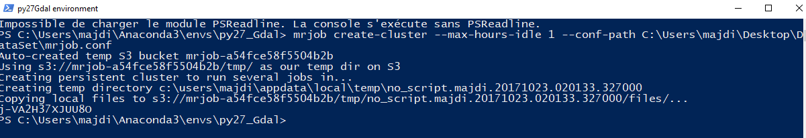
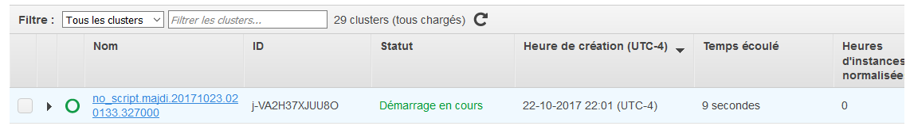
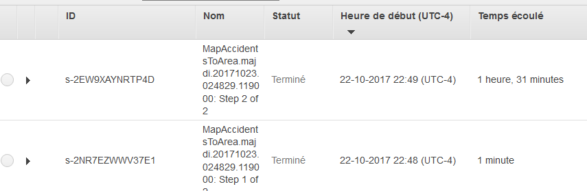
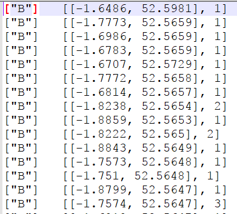

# UkAccidents_mrjob_EMR
Use Amazon EMR to create Hadoop cluster and run Python mrjob jobs and Pig Latin scripts to explore “UK Car Accidents 2005-2015" dataset.

## Introduction
We will create a Hadoop cluster in Amazon EMR using mrjob commands executed within a local machine terminal (PowerShell in my case). Later, we will run scripts in Python/Pig Latin to map the car accidents coordinates to the areas of the UK and find the regions having the high count of accidents and casualities.

For the Python script, we will use the **Shapefiles (geospatial vector data format)** to locate each car accident coordinates within its region in the UK.

## Environment
Windows(local machine), AWS.
## Technologies
Hadoop, EMR, S3, MapReduce, CANOPY, Python 2.7, mrjob, Pig Latin.

## Dataset
UK Car Accidents 2005-2015 (Data from the UK Department for Transport).
You can get this data form https://www.kaggle.com/silicon99/dft-accident-data

For the shapefiles of the UK postcode boundaries, you can upload them from http://www.opendoorlogistics.com/wp-content/uploads/Data/UK-postcode-boundaries-Jan-2015.zip


## Steps
1. Create a S3 bucket and upload the files into it. For the mrjob script and the configuration file (mrjob.conf), you can keep them in the local machine.

2. Run the following command in your local machine terminal to create the Hadoop cluster in Amazon EMR. You have to run the mrjob command from the directory where your Python environment lies and the mrjob package is installed. As a response you get your cluster ID freshly created that we will use it later.
```
mrjob create-cluster --max-hours-idle 1 --conf-path C:\Users\majdi\Desktop\DataSet\mrjob.conf 
```
For further information about the cluster configuration on EMR, you can check mrjob documentation on https://mrjob.readthedocs.io/en/latest/guides/emr-opts.html



3. On your Canopy terminal, you run the following command to excute the mrjob script against the data previously loaded in your S3 bucket. In the same way, you can keep the Python script and the configuration file locally.
~~~~
!python C:\Users\majdi\Desktop\DataSet\MapAccidentsToArea.py -r emr s3a://majdi-bucket/Accidents0515.csv --conf-path  C:\Users\majdi\Desktop\DataSet\mrjob.conf --shp s3a://majdi-bucket/Areas.shp --shx s3a://majdi-bucket/Areas.shx --dbf s3a://majdi-bucket/Areas.dbf --cluster-id j-VA2H37XJUU8O --output-dir=s3://majdi-bucket/output
~~~~
**I highlight here the fact that we are using the shapefiles (.shp, .shx and .dbf) to map the car accidents coordinates to the UK regions.**

4. YOUPI! After an almost one hour and a half, we get the results.



As an output we get something like this where we see the area code, the car accident coordinates (longitude, latitude) and the accidents count that occured in these coordinates.



5. 

